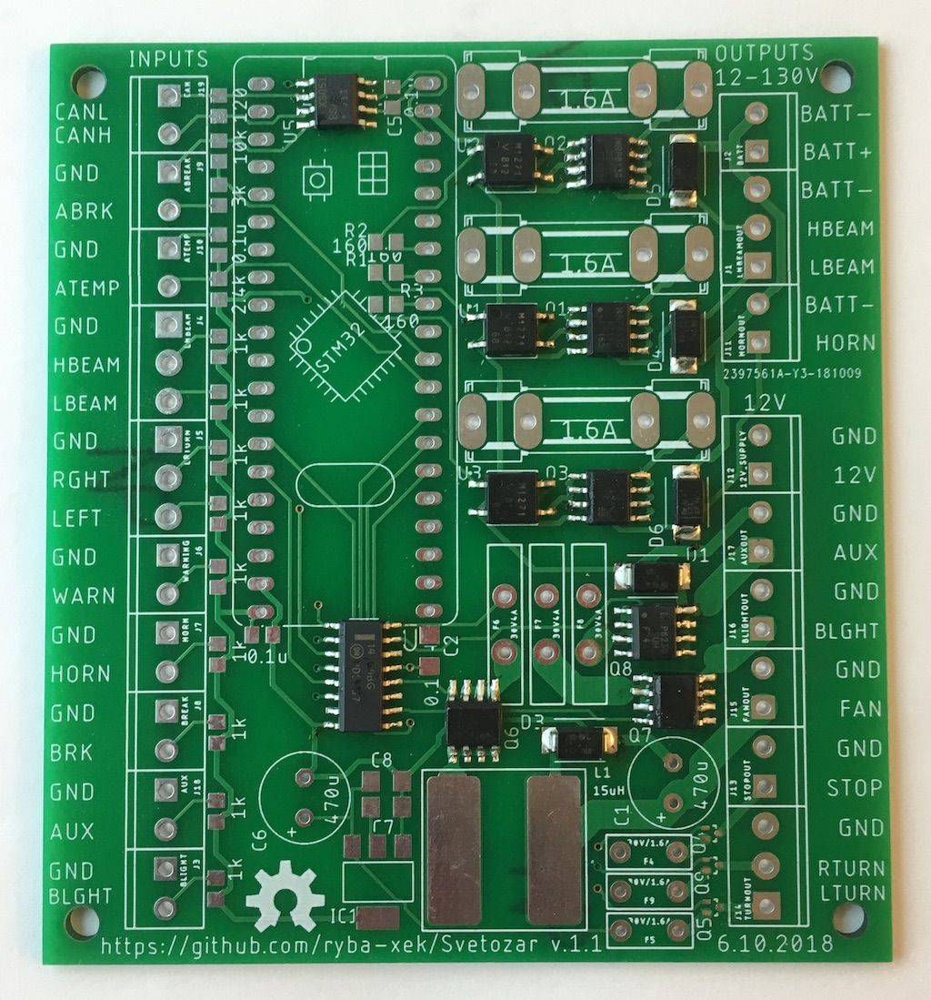

# Svetozar: an open-source e-vehicles peripherals controller

View this project on [CADLAB.io](https://cadlab.io/project/1290).

_Current project status_: in active development. Some features work, some don't.

## In a nutshell:



This device allows you to control headlights/turn signals/horn/fan/etc on a typical e-bike/e-scooter.
Based on a STM32F103 [Blue pill board](https://wiki.stm32duino.com/index.php?title=Blue_Pill).
It consists of a ‘Blue pill’ board with STM32F103 microcontroller which is widely available
on eBay or [Aliexpress](https://www.aliexpress.com/af/STM32F103C8T6.html?site=glo&origin=n&spm=2114.search0604.0.0.7f4960689ztJHF&filterCat=400103%2C200215223%2C200084026&jump=afs&groupsort=1&SearchText=STM32F103C8T6&SortType=price_asc&initiative_id=SB_20181031001708)
and a custom-built board with high-voltage circuitry. (e.g. you can order this board at [jlcpcb.com](https://jlcpcb.com/) for around 11$/10 pcs delivered.)

Device requires an external 12V power source and is able to switch 6x 12V outputs plus 3x 12..150V outputs
(which have a separate 12..150V power input). One of the 12V outputs is intended to drive a high-current fan and generates a stabilized 0..12V current
for a smooth fan speed control. CAN bus is also supported, so you can write some code to interact with other CAN devices.
There are 9x digital inputs on the left side which trigger when connected to ground and two analog inputs —
one accepts 0 to 5V voltage, the other should be used with KTY84/130 temperature sensor (or NTC10k, but you'll have to change input resistors to match the sensor).

## Current functions:

- Stoplight has medium brightness when no stop input is triggered 
- ABRK & BRK trigger stoplight to full brightness with a starting blink
- LEFT, RGHT, WARN trigger (left/right/both) turn signals flash with ~1 Hz frequency
- LBEAM triggers LBEAM output
- HBEAM triggers both LBEAM & HBEAM outputs
- HORN triggers HORN output
- AUX triggers AUX output
- BLGHT triggers BLGHT output

## Firmware

### Requirements

* [Arduino IDE](https://www.arduino.cc/en/Main/Software)
* Arduino SAM boards (Cortex-M3) support installed from Ardiuno IDE's boards manager
* [coddingtonbear's fork](https://github.com/coddingtonbear/Arduino_STM32) of Arduino STM32 ‘hardware’ files with hardware CAN support (`HardwareCAN` git branch)
* [STM32duino bootloader](https://github.com/rogerclarkmelbourne/STM32duino-bootloader/raw/master/binaries/generic_boot20_pc13.bin) for Blue pill boards
* Some STM32 [ST-Link/V2](https://github.com/pavelrevak/pystlink) or [USB-TTL](https://www.st.com/content/st_com/en/products/development-tools/software-development-tools/stm32-software-development-tools/stm32-programmers/flasher-stm32.html) flashing software

## Flashing a Blue Pill board with the bootloader

### Mac OS X
#### Requirements
##### Software
* python 3.x (brew install python)
* libusb (brew reinstall libusb)
* pyusb (pip3 install pyusb)
* [pystlink](https://github.com/pavelrevak/pystlink)

##### Hardware
* ST-Link/V2 or V2-1 programmer (pystlink does not support V1, please use native ST software under Windows)

#### Process
1. Download [STM32duino bootloader](https://github.com/rogerclarkmelbourne/STM32duino-bootloader/raw/master/binaries/generic_boot20_pc13.bin)
2. Connect ST-Link programmer to the board
3. Flash it with
```shell
    pystlink --cpu STM32F103xB flash:erase:verify:generic_boot20_pc13.bin
```
4. Reset or re-connect the board

### Windows
#### To Do

#### Flashing via USB-TTL adapter under Windows
[Please read this russian article](https://habr.com/post/395577/)

## Installing Arduino with STM32duino support
[STM32duino installation instructions](https://github.com/rogerclarkmelbourne/Arduino_STM32/wiki/Installation)

### Mac OS X
1. Install Arduino
2. Install libusb (brew install libusb)
3. Launch Arduino IDE, go to Tools -> Board: ... -> Boards Manager and install the Arduino SAM boards (Cortex-M3) support.
4. Download [coddingtonbear's fork](https://github.com/coddingtonbear/Arduino_STM32) of Arduino STM32 ‘hardware’ files
with hardware CAN support, checkout `HardwareCAN` branch and move and rename it to ```~/Documents/Arduino/hardware/Arduino_STM32```.
5. In Arduino IDE select Tools -> Board: ... -> Generic STM32F103C series.
5. In Arduino IDE select Tools -> CPU speed(MHz): -> 48MHz.

## Credits
Blue pill board library is from [github/sagarHackeD](https://github.com/sagarHackeD/STM32Bluepill_eagle)
VOM1271T.lbr, MAX3051ESA.lbr & MC14504BDR2G.lbr are from [SnapEDA](https://www.snapeda.com/)